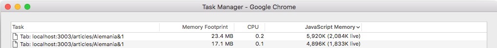
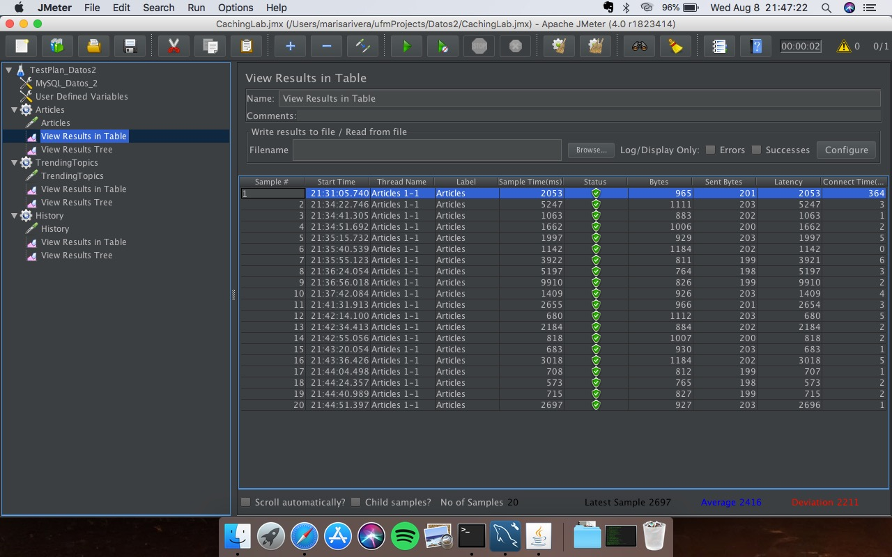
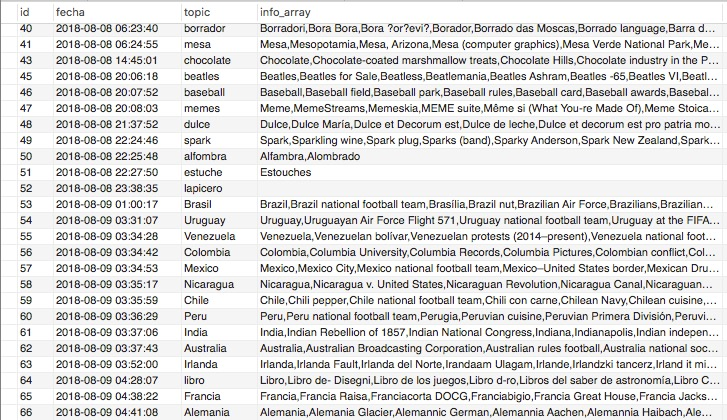
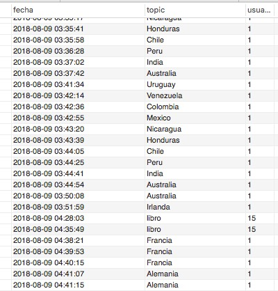

# Cache implementation
### Team members:
 * Ricardo Mendoza
 * Maria Ines Montenegro
 * Maria Isabel Rivera
 * Luis Angel Tortola

### User Story
*As a search application API user I want to be able to get related information to some keywords I may enter. And keep those searches in my history.*


### Requirements

* Node.js installed - [Check it here](https://nodejs.org/en/)
* JMeter installed - [Check it here](https://jmeter.apache.org/)
* MySQL JMeter Connection Drivers - [Check it here](https://dev.mysql.com/downloads/connector/j/), you can also look at [this tutorial](https://www.3pillarglobal.com/insights/integrating-jmeter-and-mysql-into-your-database)

### Step-by-step Installation

**Step 1:**
Download or clone this repository in your computer.


**Step 2:**
Enter to the API folder in your terminal:

```
cd API/
```
Then enter the following command to install all the Node.js dependencies:

```
npm install
```


**Step 3:**
To start running the API, just tyoe the following command in the same path you were on the last step:

```
nodemon app.js
```

If it's running properly, you should see a message like this in your terminal: `[nodemon] starting 'node app.js'`.


 
Now everything is set and you can proceed to test it.


### Cache Test

In order to run the test, just launch JMeter, import the `cachingTest.jmx` file and press Start. Three tests will run and you will be able to see the results.


### Comparisons (profiling)

#### Disc Used 

The following *disc usage* shown makes reference to the free storage available in the AWS MySQL RDS instance used.

##### Before new requests


##### After (10) requests stored in db


##### Memory and CPU

The following data was obtained via de Task Manager, the first registry shows the memory and cpu percentage used when making a new request and the second one shows the memory and cpu percentage used when making a request to the cache.



##### Response time

The following times shown were obtained directly in JMeter when running the test. The first *10* rows are new requests made to the endpoint and the last *10* are requests made to the cache. The response time is shown under the *latency* field and it is given in milliseconds. 



### Architecture Diagram


### Data structures

* The object received from a request to the endpoint is like the following JSON object:

```
{topic: ,
articles: {
}} 
```

* The cache in MySQL is stored in a table with the fields:
```
id | fecha | topic | info_array
```



* Another table is used in the database to keep the *User Search History*, it is accomplish by logging the requets in a table with the fields:
```
fecha | topic | usuario
```


