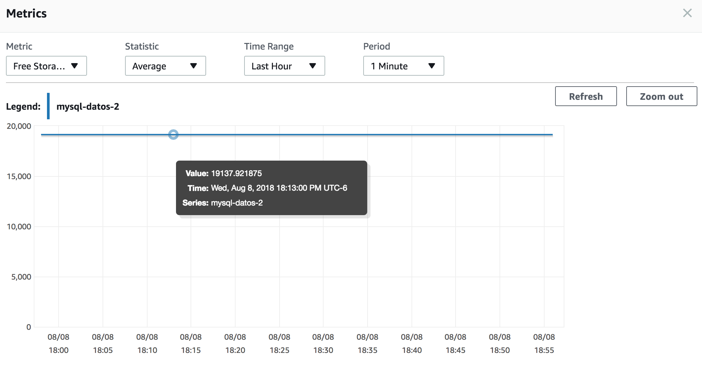
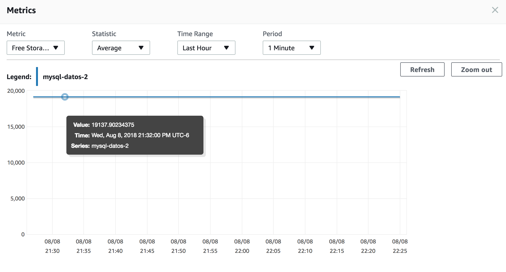
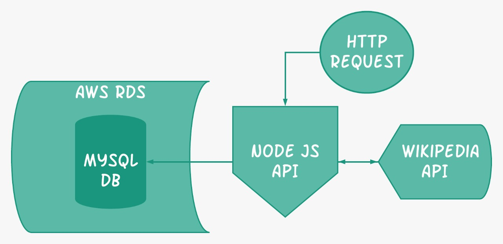

# Cache implementation

### User Story
*As a search application API user I want to be able to get related information to some keywords I may enter. And keep those searches in my history.*


### Requirements

* Node.js installed - [Check it here](https://nodejs.org/en/)
* JMeter installed - [Check it here](https://jmeter.apache.org/)
* MySQL JMeter Connection Drivers - [Check it here](https://dev.mysql.com/downloads/connector/j/), you can also look at [this tutorial](https://www.3pillarglobal.com/insights/integrating-jmeter-and-mysql-into-your-database)

### Step-by-step Installation

**Step 1:**
Download or clone this repository in your computer.


**Step 2:**
Enter to the API folder in your terminal:

```
cd API/
```
Then enter the following command to install all the Node.js dependencies:

```
npm install
```


**Step 3:**
To start running the API, just tyoe the following command in the same path you were on the last step:

```
nodemon app.js
```

If it's running properly, you should see a message like this in your terminal: `[nodemon] starting 'node app.js'`.


 
Now everything is set and you can proceed to test it.


### Cache Test

In order to run the test, just launch JMeter, import the `cachingTest.jmx` file and press Start. Three tests will run and you will be able to see the results.


### Comparisons (profiling)

#### Disc Used 

The *disc usage* makes a reference to the free storage available in the AWS MySQL RDS instance used.

##### Before new requests



##### After (10) requests stored in db




### Architecture Diagram


