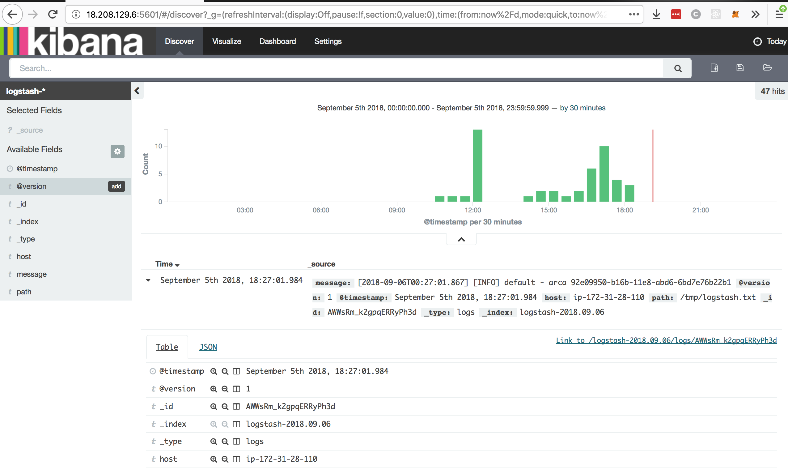
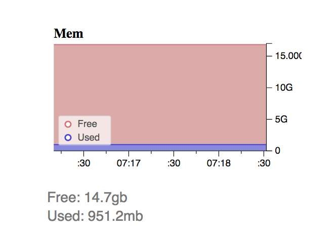

# Cache implementation
### Team members:
 * Ricardo Mendoza
 * Maria Ines Montenegro
 * Maria Isabel Rivera
 * Luis Angel Tortola

### User Story

**API user:**   

*"get related information to some keywords I may enter in a simple form and keep those searches in my history so I can run the same search again. And create as many searches as I require."*

**API admin:**

*"Understand usage metrics from all users and run reports from historical information"*

### Requirements

* Node.js installed - [Check it here](https://nodejs.org/en/)
* JMeter installed - [Check it here](https://jmeter.apache.org/)
* MySQL JMeter Connection Drivers - [Check it here](https://dev.mysql.com/downloads/connector/j/), you can also look at [this tutorial](https://www.3pillarglobal.com/insights/integrating-jmeter-and-mysql-into-your-database)
* Redis installed [Check it here](https://www.sitepoint.com/using-redis-node-js/)
* ELK Stack installed [Check it here](https://www.youtube.com/watch?v=ge8uHdmtb1M&list=PL5zjQdAWZiUyxxHI72D_O5i77jlJrxKZr&index=1) [and here](https://github.com/andrewpuch/elasticsearch-logstash-kibana-tutorial)
* ELK - Head and Big Desk plugins installed

### Step-by-step setup

**Step 1:**
Download or clone this repository in your computer. (Or instance, we are using an AWS Linux AMI EC2 instance)


**Step 2:**
Enter to the API folder in your terminal:

```
cd API/
```
Then enter the following command to install all the Node.js dependencies:

```
npm install
```


**Step 3:**
To start running the API, just type the following command in the same path you were on the last step:

```
nodemon app.js
```

If it's running properly, you should see a message like this in your terminal: `[nodemon] starting 'node app.js'`.


**Step 4:**
To start elasticsearch and logstash, do the following:

```
cd API
```
```
service elasticsearch start
```
```
service elasticsearch status
```
```
service logstash start
```
```
service logstash status
```

**Step 5:**
To start kibana, do the following:

```
sudo su 
```
```
cd /root
```
```
cd kibana-4.1.2-linux-x64
```
```
nohup ./bin/kibana &
```

### Accesing the API and ELK

In order to access the ELK platforms and plugins, you should have a public IP in your instance. You can acces through the following urls, thought you have to change the *18.208.129.6* IP to your's.

* API search:

```
18.208.129.6:3003/search
```


* Elasticsearch:

```
18.208.129.6:9200
```

* Kibana:

```
18.208.129.6:5601
```

* Head plugin:

```
18.208.129.6:9200/_plugin/head
```

* Big Desk plugin:

```
18.208.129.6:9200/_plugin/bigdesk
```

If everything is running properly you should be avaible to visualize the following:

* Big desk:


* Head:


* Kibana:



* Kibana hits dashboard:


* Logstash logs on Kibana:


* Kibana custom *count* dashboard:


### API/Cache Test

To cache results, we are using Redis. In order to run the test, just launch JMeter, import the `ELKlab.jmx` file and press Start. Three tests will run and you will be able to see the results.

### Profiling

#### Disk 

With *head* plugin, we can see that 51 docs created (51 logs saved), take as little as  92.4KB.


#### Memory 

With *big desk* plugin, we can see the memory used to run the full ELK stack, Redis and Node.js:




Less than 1GB used out of the 16GB availabe in the instance.

#### CPU

With *big desk* plugin, we can see how many threads ELK is running:


##### Response time

---- Pendiente -----

### Architecture Diagram


### Data structures

* API search result:


* Logs registered in logstash:


